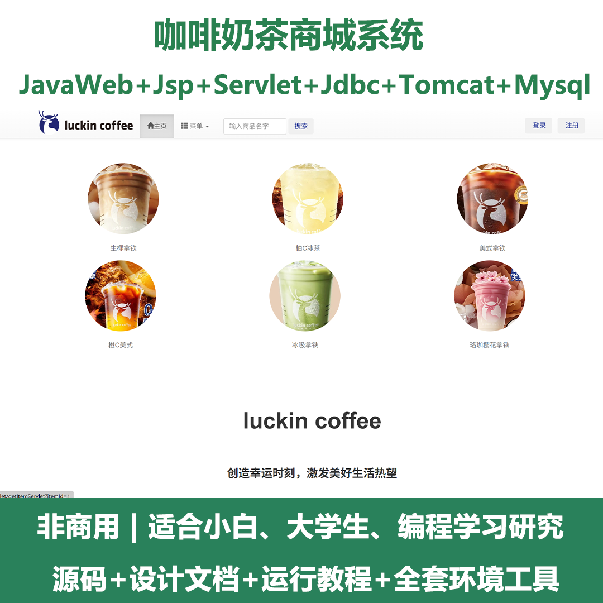
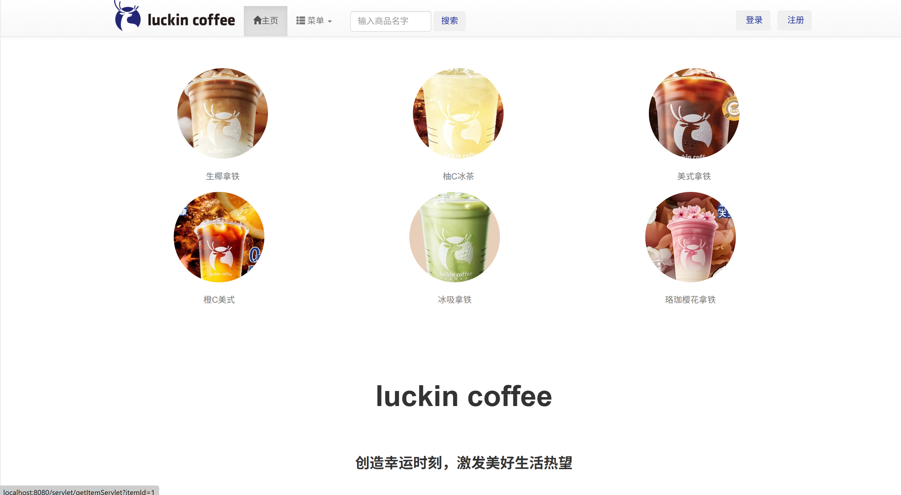
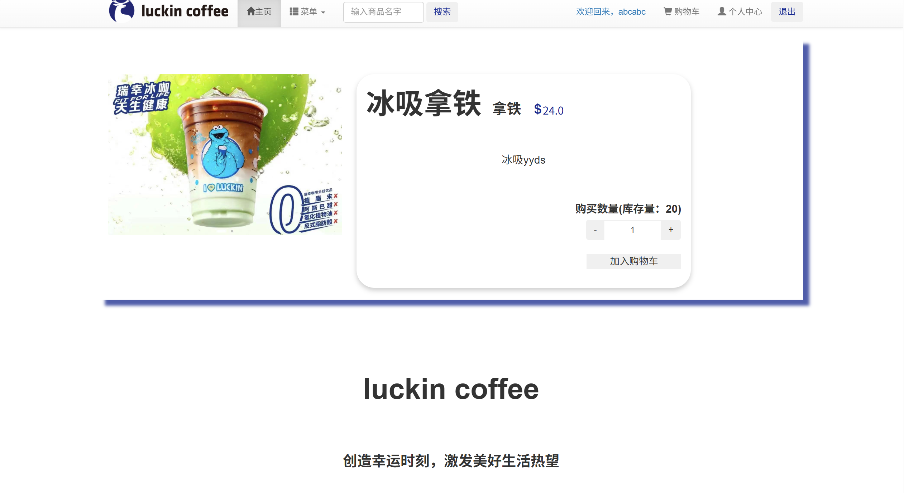
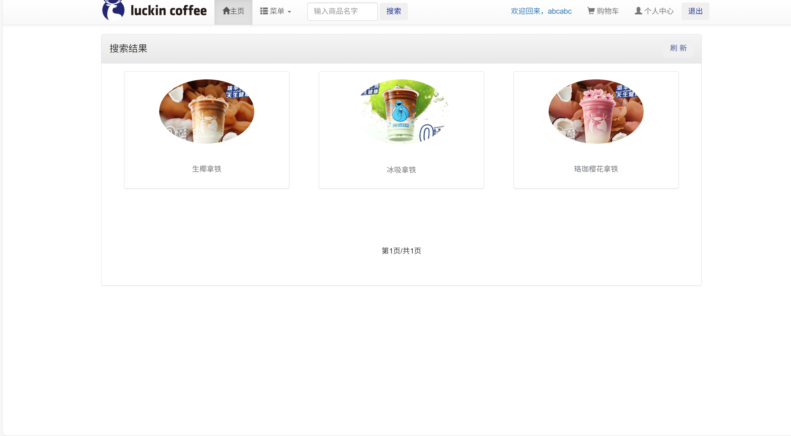
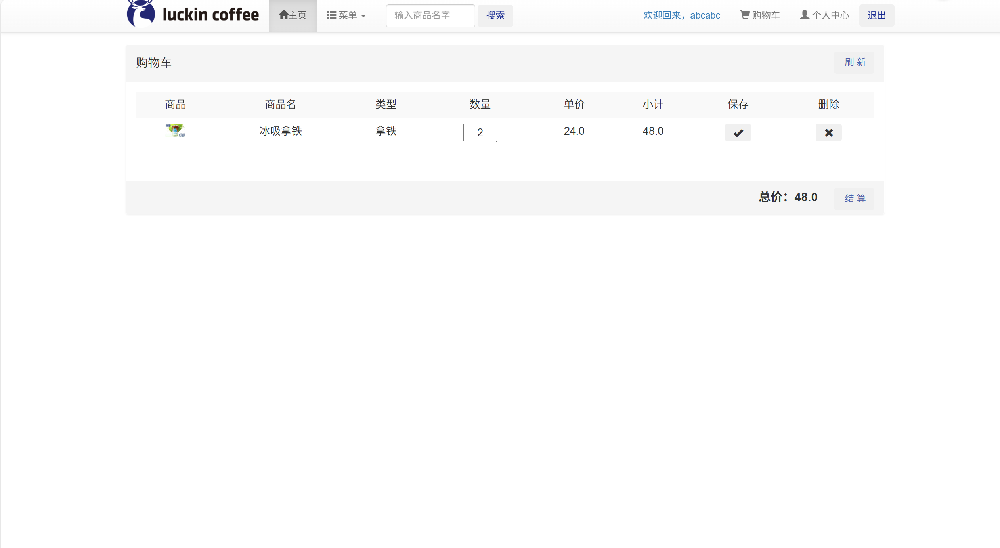
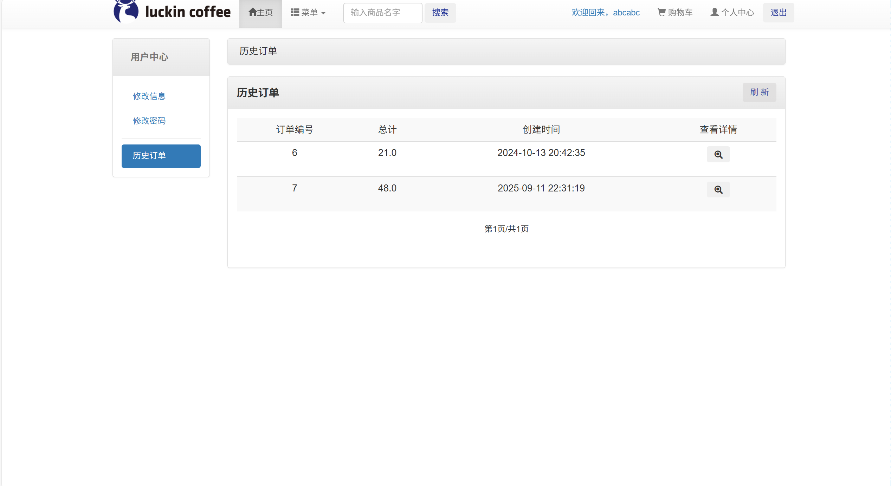
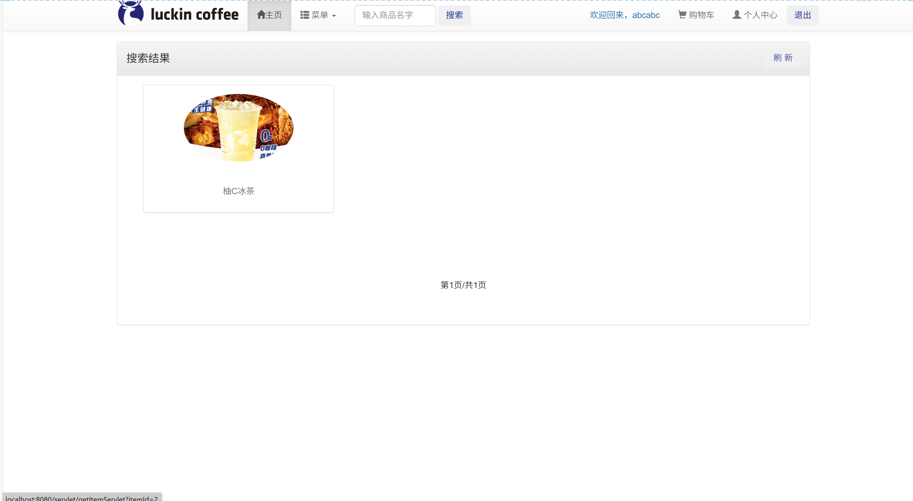
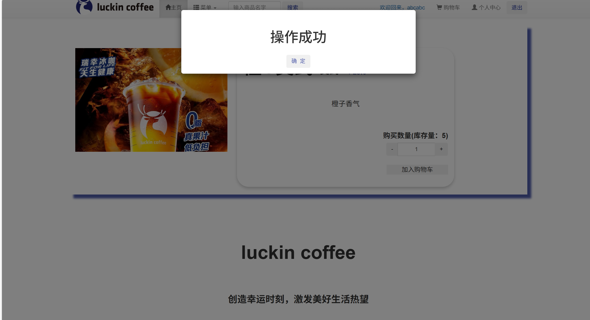

# jspServlet035
jspServlet035咖啡奶茶商城系统+BG
 
## 源码问题查看主页咨询

### 一、关键词

咖啡奶茶商城系统，商城系统

### 二、作品包含
源码+数据库+设计文档+全套环境和工具资源+本地部署教程

### 三、项目技术
前端技术：Html、Css、Js、Jquery、Bootstrap
后端技术：Java、JSP、Servlet、JDBC

### 四、运行环境（以下版本亲测，其他版本兼容性请自行测试）
开发工具：IDEA/eclipse

数据库：MySQL5.7或8.0

服务器：Tomcat8.5或Tomcat9.0

数据库管理工具：Navicat10以上版本

环境配置软件： JDK1.8

浏览器：谷歌浏览器

### 五、项目介绍
项目编号：jspServlet035

咖啡奶茶系统为用户提供一个基本的购物系统。此系统存在两种用户，普通用户和管理员用户

普通用户在系统注册后可进行登录，登陆后可对自己的个人资料进行修改同时按需求进行选购商品，将商品加入购物车后购买。

管理员用户通过管理员登录后可以对用户账号，商品，账单进行管理。前台不提供管理员账号注册，直接在后台数据库中加入管理员账号

### 六、运行截图

、
、

